# Test Cloud Foundry's auto-scaling and self-healing capabilities on IBM Cloud

In traditional computing, hardware resources have always been a restriction. For instance, when a web server receives more requests than it can handle, it simply dies because it is bound by the hardware resources inside. In today's fast-paced digital world, applications need to constantly respond and adapt to the ever-changing environment we're in.

Thankfully, cloud computing came to the rescue by introducing features like auto-scaling and self-healing. Auto-scaling automatically scales computing resources up or down according to the current load on the application. This provides your application with consistent and predictable performance under different loads and situations. Self-healing restarts your applications whenever it detects that the app has crashed or is down, increasing the overall availability of your applications. These features enable developers to build resilient and fault-tolerant applications that can handle changes and perform well under pressure.  

In this tutorial, you will learn how to configure auto-scaling in Cloud Foundry on IBM Cloud. You also will learn how to load test your application and use the metrics tab on IBM Cloud Foundry to monitor the app's CPU usage and watch it automatically scale up and down. You will also get an opportunity to test and see how Cloud Foundry self-heals crashed applications. This will give you an idea of how you can utilize Cloud Foundry to better serve your apps. 

The solution I’ll be sharing in this tutorial is a Node.js web server demo application that calculates how many prime numbers there are between 1 and a given number, or ***n***. The prime number calculator is great for putting the CPU under load since it contains two nested loops and has a complexity of O(n2).

    var countPrimeNums = (n) => {
        var result = 0;
        for (var i = 1; i < n; i++) {
            var isPrime = true;
            for (var j = 2; j < i; j++) {
                if (i % j == 0) {
                    isPrime = false;
                    break;
                }
            }
            if (isPrime) result++;
        }
        return result;
    }

The web server has two routes handling GET requests.

1. The **/** *(root)* route which takes a number ***n*** in the URL as a query string parameter and injects it in the function above and finally returns the result. This is the route you will use to load test your application.

1. The **/crash** route which deliberately crashes the server in order to test the self-healing feature in Cloud Foundry.

## Prerequisites

To complete this tutorial, you need:

- An active [IBM Cloud Account](https://cloud.ibm.com).
- [IBM Cloud CLI](https://github.com/IBM-Cloud/ibm-cloud-cli-release/releases/) installed.
- [Node.js](https://nodejs.org/en/) installed.

## Estimated time

This tutorial takes about 30 minutes to complete.

## Steps

1. [Deploy the app on IBM Cloud](#1-Deploy-the-app-on-IBM-Cloud)
2. [Test the self-healing feature](#2-Test-the-self-healing-feature)
3. [Configure Cloud Foundry auto-scaling](#3-Configure-Cloud-Foundry-auto-scaling)
4. [Run the load test and see results on the metrics tab](#4-Run-the-load-test-and-see-results-on-the-metrics-tab)

### 1. Deploy the app on IBM Cloud 

Before I get started I’d like to point out that the Cloud Foundry lite plan on IBM Cloud provides you with 256 MB of memory for your apps. This demo uses all 256 MB, so if you already have any existing Cloud Foundry apps, please remove them or consider upgrading to the standard plan.

1. To begin, clone [this repo](https://github.com/usfngm/cf-auto-scaling-self-healing).

1. Log in to your IBM Cloud account using the IBM Cloud CLI: 

     `ibmcloud login`

1. Target a Cloud Foundry org and space:  

     `ibmcloud target --cf`.

1. If you want, you can change the application name by editing the **name** value in the `manifest.yml` file to your application name. For example, _my-app-name_.

1. Deploy the app: 

    `ibmcloud cf push`

    Make sure you run this command while you're inside the project's directory.

1. After deployment is done, the CLI will show you the public route (URL) in which you can access your app from. In my case, my route is `primenumbercalculator-nice-wombat-pf.eu-gb.mybluemix.net`. Remember, your route will be different than mine.

    

      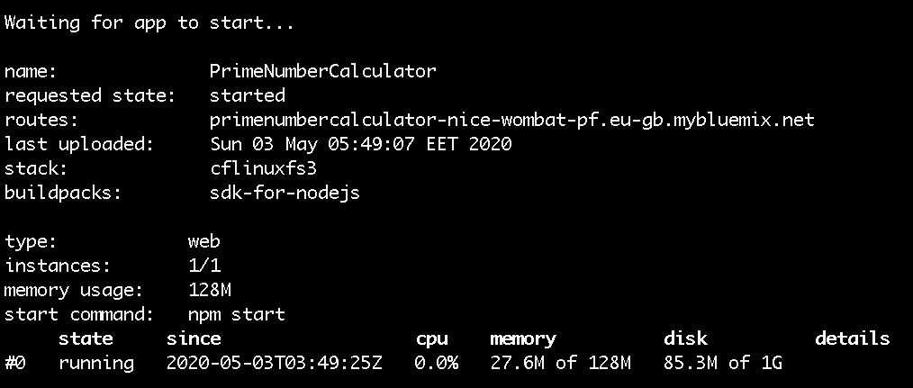
    
    

    If you ever lose your app's URL, you have two options. You can either use the command `ibmcloud cf app <your_app_name>` and it will output the app's info again or you can find it by visiting [IBM Cloud](https://cloud.ibm/com) and navigating to your resource page which can be found in the [Resource List](https://cloud.ibm.com/resources) under *Cloud Foundry Apps*

1. Copy the route and paste it into your browser to verify that the app is live and working.

    Try passing the variable *n* in your URL to test the prime number calculator:

    

      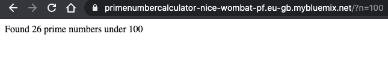
    
   

### 2. Test the self-healing feature

Self-healing comes out of the box with Cloud Foundry and doesn’t require configuration. Thanks to the technology of containerization, it is also very easy and straightforward to test.

In order to test the self-healing capabilities of your app, you need to first crash your app on purpose by using the `/crash` route. Then, you need to quickly make a valid request to the prime number calculator service on the root route. You should see that the server is down. After a few seconds, make another request and verify that your server is back up and running without any intervention.

1. Open two browsers side-by-side or two tabs so you can switch between them quickly.

1. On one tab, copy and paste your app's URL, add `/crash` at the end, and click **enter**. The app should crash, and you should see something like this:

    

      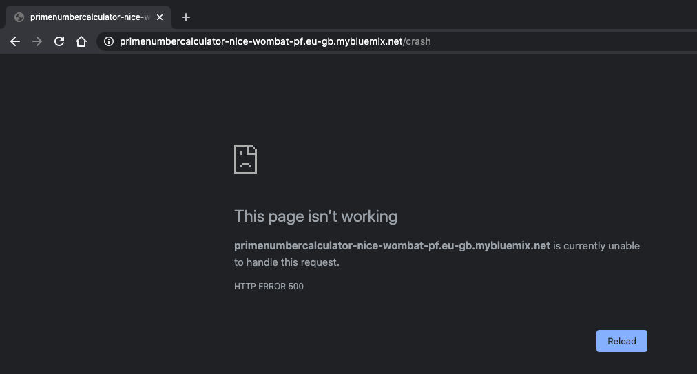
    
  

1. Quickly navigate to the other tab and make a normal request at the root route (like the one you made earlier). If you're fast enough, you should receive the following error:

    

      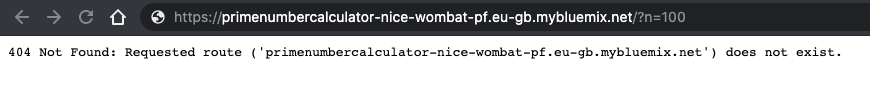
    
  

    You can always try step 2 again in case you didn't receive the error or if you weren't fast enough to make the second request.

1. Wait 30 seconds and refresh the browser again. You should receive a normal response again from the server.

    Cloud Foundry detected that the application crashed or is down and restarted it, automatically making it available again.

You can also confirm that your app has crashed and restarted by visiting your resource page on IBM Cloud.

1. Log in to your [IBM Cloud Account](https://cloud.ibm.com).

1. Navigate to your [Resource List](https://cloud.ibm.com/resources).

1. Under Cloud Foundry Apps, find the name of your app and click on it.

1. Your resource page should open. This page has various information about your Cloud Foundry application as well as tools to help you manage your apps.

1. Scroll down to the crash report under the **Activity Feed**:

  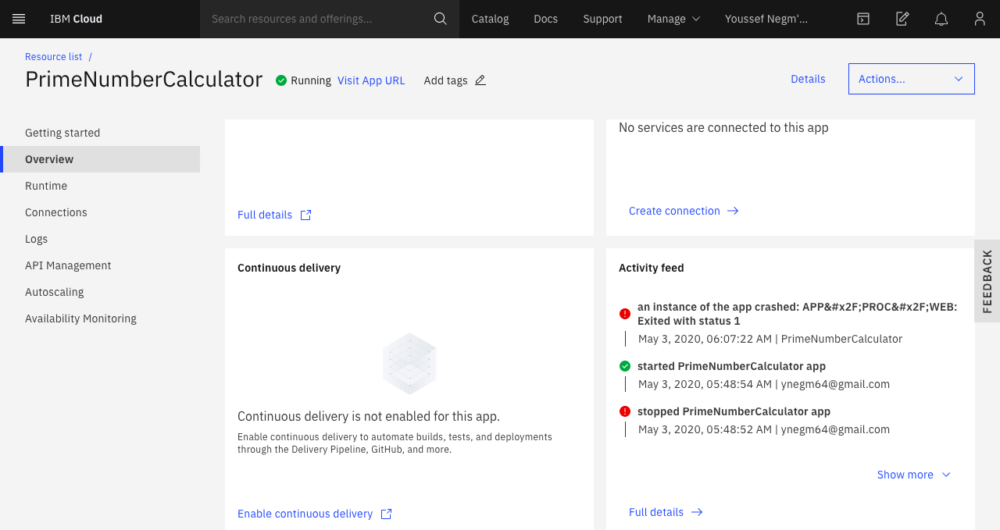

  

### 3. Configure Cloud Foundry auto-scaling

Now it’s time to configure auto-scaling rules, load test your application, and watch as it scales up and down automatically.

1. Once again, go to the resource page on IBM Cloud and find your [Resource List](https://cloud.ibm.com/resources).

1. Under Cloud Foundry Apps, find the name of your app and click on it.

1. Now click on **Autoscaling** from the left menu.

1. Next, configure the auto-scaling rules. You will have two auto-scaling 
rules; one for scaling up and another for scaling down.

1. Set the **minimum** instance count to **1** and the **maximum** instance count to **2**.

1. Now set the first rule:

    _If average `cpu` `>=` `20%` for `60` seconds, then **increase** `1` `instance(s)`. Cooldown period `60` seconds._

1. Then, set the second rule:

    _If average `cpu` `<=` `5%` for `60` seconds, then **decrease** `1` `instance(s)`. Cooldown period `60` seconds._

    Your auto-scaling rules should look like this:

    

      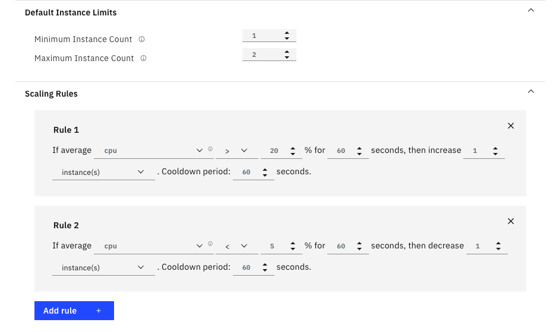
    

    After making sure everything is perfect, click the **save** button at the top of the page.

1. Now open the **Metrics** tab. If everything went smoothly, you should see your auto-scaling rules reflected on the metrics tab:

    

      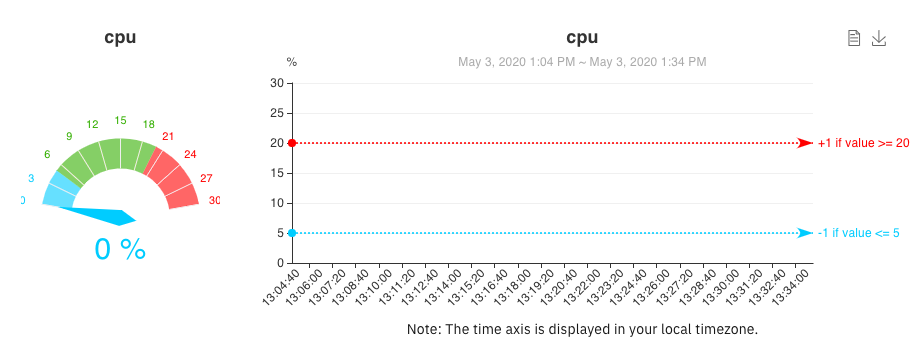
    

    Great! Now you’re ready to load test your application and watch it scale up and down automatically.

### 4. Run the load test and see results on the metrics tab

1. Download the [loadtest](https://www.npmjs.com/package/loadtest) tool by running the following: 

    `npm install -g loadtest`. 

    Please be advised that this command line should run with administrator privileges. For Linux/macOS, use `sudo`. For Windows, run the command prompt as admin. It’s also important to note that npm is the Node Package Manager and that it comes with Node.js. Make sure you have installed Node.js before running this command.
        
    The loadtest tool allows you to send many requests per second to your server to mimic what would happen in a real scenario. This will increase the CPU usage and trigger the auto-scaling rules you set in the previous step.

1. Start the load test:

    loadtest -c 20 --rps 200 -k https://<your-url-here>/?n=1000

    The `--rps` flag here indicates the requests per second. To stress load your app, you need to send 200 requests per second, asking your app to find how many prime numbers there are between 1 and 1000. For more information about the loadtest tool, see the [loadtest GitHub repo](https://github.com/alexfernandez/loadtest).

    It is recommended to use the same values and parameters as this tutorial. However, in some cases, the CPU usage may slightly differ, so feel free to adjust the `--rps` flag to either increase or decrease the load accordingly.

    The output of running this command should look something like this:

    

      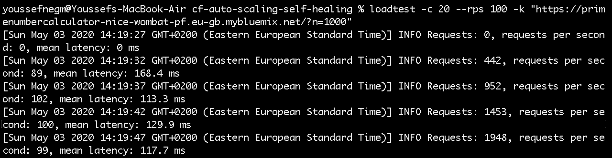
    

    For the sake of this tutorial, while load testing, make sure you pass the **n = 1000**. Less might not stress the CPU enough and more may lead to the application crashing.

1. Now it’s time to monitor the CPU usage in the metrics tab. After a few minutes, you should start seeing the CPU usage increasing in the metrics tab until it crosses the threshold, as shown below:

    

      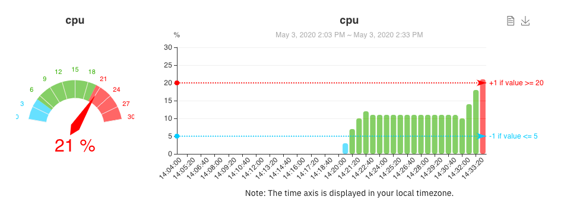
    

1. Next, wait for the auto-scale to occur. Based on the auto-scaling rules you set, the application will auto-scale to 2 instances if the CPU usage stayed at 20% or more for 60 seconds. 

    After waiting a minute or two, you should find that the CPU usage suddenly went down to 13% ~ 14%. This happened as a result of the new instance that was automatically created to take some of the load you had on your original instance.

    

      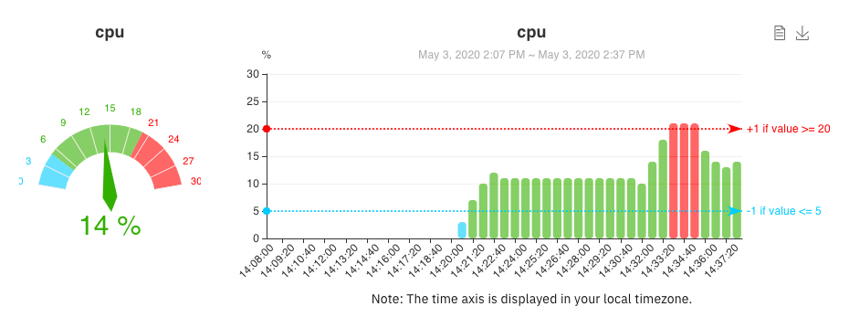
    

1. Confirm that the auto-scale has occurred by clicking on **Runtime** from the left menu. Once you click **refresh**, you should see that you now have 2 instances running:

    

      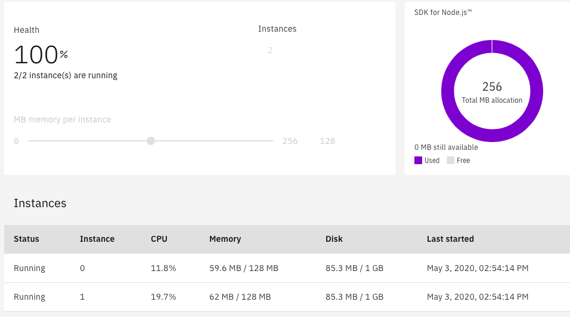
    

1. Test the auto down scaling by going back to the **Metrics** tab under the **Autoscaling** page. The CPU usage should be stable at around 13% ~ 14% now.

    What you want to do is reduce the load by 75% so you can hit CPU usages under 5% and watch the application as it down scales automatically.

1. Stop the load test by clicking **Ctrl + C**.

1. Run another load test but with 75% less requests per second:

    loadtest -c 20 --rps 50 -k https://<your-url-here>/?n=1000

    Go back to the metrics, and you will find that the CPU usage is decreasing. It will stabilize at around 3% ~ 4%.

    Just like the case of auto-scaling up, according to your auto-scaling rules, the app will auto-scale down if the CPU usage stayed at 5% or less for 60 seconds.

    After waiting a few minutes, you should see that the CPU usage increases slightly to 6% ~ 7%, which means that the app has down scaled successfully back to 1 instance (hence the slight increase of CPU usage).

    Again, you can confirm the down scaling by navigating to the **Runtime** option from the left menu and clicking **refresh**. You should see that the app now has 1 instance running:

    

      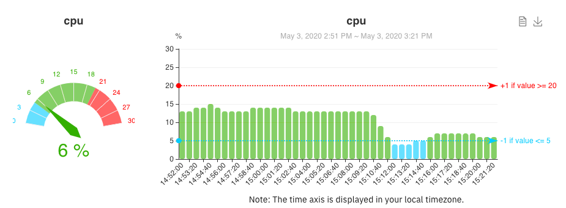
    

    

      
    

## Summary

In this tutorial, I discussed, configured, and tested auto-scaling and self-healing in Cloud Foundry and presented how beneficial they are in today's modern digital world. 

To summarize, by completing this tutorial you learned:
 
* How easy it is to configure Cloud Foundry auto-scaling rules on IBM Cloud.
* How to test your application using the loadtest tool.
* How to test the self-healing feature by deliberately crashing your app.
* What it looks like to watch an app restart and become responsive again.
